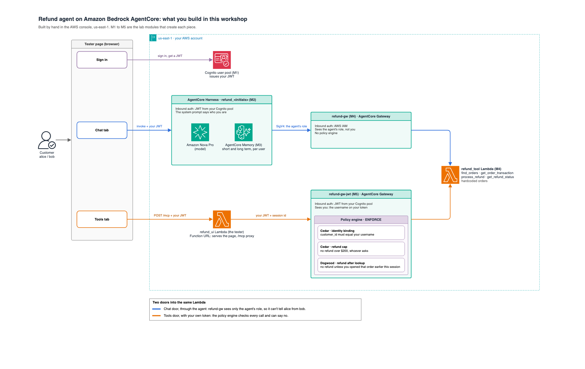

# Labs

This page just has the steps. Do them in order. If something looks wrong, stop and fix it (or ask for help) before you move on.

## Before you start

1. **Set the region to `us-east-1` (N. Virginia)** in the AWS console region picker.
   Everything in these labs lives there. If you build something in the wrong
   region, nothing will find it.

2. **Open a notepad.** You will copy a few values and paste them later:

   | Value | You get it in | You paste it in |
   |---|---|---|
   | User pool ID | M1 step 7 | M2, M5 |
   | App client ID | M1 step 8 | M2, M5 |
   | Tools Lambda ARN | M4 step 5 | M4, M5 |
   | `refund-gw` ARN | M4 step 13 | M4, end of M5 |
   | `refund-gw-jwt` ARN | M5 step 5 | M5 policies |

4. **Switch on tracing now.** Go to **CloudWatch** → **Settings** → **X-Ray traces**
   → **Transaction Search**, and enable it with the default settings. It is once per
   account.

   > This is for M6, at the very end, but it has to happen now: only requests made
   > after it is on are recorded. Switch it on at the end and M6 has nothing to show.

### Your progress

- [ ] The tester app
- [ ] M1. Identity: create your login
- [ ] M2. The agent
- [ ] M3. Memory
- [ ] M4. Tools
- [ ] M5. Policies
- [ ] M6. Observability

## What you are building



One Lambda. Two ways in. The Chat tab goes through the agent, and the agent shows
the gateway its own AWS identity, not yours. The Tools tab goes straight in with
your login, so the policy engine can see you and can say no.

That difference is the whole point of the workshop.

---

# The tester app

**Goal:** a small web page, running as a Lambda in your account, that you use in
every lab. From now on, "the tester" means this page (the Lambda's Function
URL). You need nothing on your laptop but a browser.

1. Check the region picker (top right) says **US East (N. Virginia)**. Go to
   **Lambda** and choose **Create function**.

2. Choose **Author from scratch**. Name it `refund_ui`.

3. Open the **Runtime** dropdown and change it to **Python 3.14**. Choose **Create function**.

4. Paste the contents of [`chat/lambda_function.py`](../chat/lambda_function.py) from this repo over all the
   code in `lambda_function.py`. Choose **Deploy**.

5. Go to **Configuration** → **General configuration** → **Edit**. Set **Timeout**
   to **30** seconds. Save.

6. Give the tester permission to find your resources:
   1. Go to **Configuration** → **Permissions**.
   2. Click the **role name** → **Add permissions** → **Create inline policy** →
      **JSON**.
   3. Paste the contents of [`chat/lambda_policy.json`](../chat/lambda_policy.json) from this repo.
   4. Choose **Next**, name it `chat-ui-lookup`, and create it.

   > This allows the app to read the names of your pool, harness and gateway.

7. Make the tester reachable from your browser: Back in Lambda, go to **Configuration** → **Function URL** → **Edit**. Choose auth type **NONE**. Save.

8. Open your tester page:
   1. Go to **Lambda** → **Functions** → `refund_ui`.
   2. In **Function overview** at the top, find **Function URL** on the right. It
      looks like `https://abc123xyz.lambda-url.us-east-1.on.aws/`.
   3. Click it. The page that opens, titled **AgentCore Chat**, is your
      **tester**. Bookmark it: every lab below says "open the tester" and means
      this page.

As you build things in the labs below, they show up under **⚙ Settings** by
themselves. To check again, open **⚙ Settings** and press **Find my resources**.

**Done.** Tick *The tester app* in your progress list.

---

# M1. Identity: create your login

**Goal:** Create the mechanism that will manage the users and will issue tokens.

### Create the pool

1. Go to **Cognito** and choose **Create user pool**.

2. The first thing the wizard asks is your application:
   - Application type: **Single-page application** (so it has no client secret).
   - Name: `refund-tester`.

3. Under sign-in options, tick **User name**. Leave **Email** unticked.

   > This step matters more than it looks. If you sign in by email, Cognito sets
   > the username to a random ID like `d304d8b2-90e1-70f7`. Later your policies
   > need to compare that username to `alice`, and a random ID will never match.
   > Sign in by user name and the token says `alice`.

4. Turn **self-registration off**. You will add the users yourself.
6. Cognito now asks for a required attribute. Choose **email**. 

5. Name the pool `refund-pool` and create it.

7. On the pool's overview page, copy the **User pool ID** (it looks like
   `us-east-1_AbCdEf123`) to your notepad.

### Set up the app client

8. Open **App clients**, then your client. Copy the **Client ID** to your notepad.

9. Edit the client and turn on "Sign in with username and password: ALLOW_USER_PASSWORD_AUTH" under authentication
   flows. Save. The tester needs it.

### Add the users

10. Add three users. For each one:
    1. Choose **Don't send an invitation**.
    2. Enter the user name and email from the table.
    3. Tick **Mark email address as verified**.
    4. Set the password to `Workshop#2026`.

    | User name | Email |
    |---|---|
    | `alice` | `alice@example.com` |
    | `bob` | `bob@example.com` |
    | `mateo` | `mateo@example.com` |

    **Check:** the Users list shows `alice`, `bob` and `mateo`.

11. Open the tester, click **⚙ Settings**, and press **Find my resources**.

You log in as alice in M2: the tester only shows the login once there is an agent
to talk to.

**Done.** Tick *M1* in your progress list.

---

# M2. The agent

**Goal:** an agent that answers to people who are logged in.

**You need:** your user pool ID and app client ID from M1.

### Create the harness

1. Go to **Bedrock AgentCore** → **Harness**. Choose **Create**.

2. Name it `refund`.

3. For the model, pick **Amazon Nova Pro**. 

4. For the system prompt, paste:

   ```
   You are a customer-service refund assistant. Help the signed-in customer with
   their orders and refunds. Be brief.
   ```

5. Open **Inbound Auth** and set it up so only your pool's users get in:
   1. **Inbound Auth Type**: choose **Use JSON Web Tokens (JWT)**.
   2. **JWT schema configuration**: choose **Use existing Identity provider
      configurations**.
   3. **Discovery URL**: paste this and replace `<YOUR_POOL_ID>` with your pool ID:
      ```
      https://cognito-idp.us-east-1.amazonaws.com/<YOUR_POOL_ID>/.well-known/openid-configuration
      ```
   4. **Allowed clients**: your app client ID.

6. Save. Wait until the status is **READY**.

7. On the details page, find the **harness ARN**. It looks like
   `arn:aws:bedrock-agentcore:us-east-1:123456789012:harness/refund-AbC1234567`.


### Talk to it

8. In the tester, open **⚙ Settings** and press **Find my resources**.

9. Log in as **alice** with `Workshop#2026`. The first login asks you to pick a new
   password. Pick one and remember it.


10. Open the **Chat** tab and send **hello**.

    **Check:** the agent replies.

11. Now open your harness in the console and choose **Test Harness**. Send **hello**
    there too.

    It works without any login, because the console signs you in with your AWS
    user. In the playground you can type any **Actor ID** you like, and the agent
    believes it. The rest of the labs replace that guess with a checked identity.

12. In the tester's Chat tab, ask: **what are my orders?** Then open **Raw
    response** under the reply.

    The agent cannot see any orders yet, but a harness comes with a few built-in
    tools, such as `file_operations` for files in its own sandbox. You will
    probably see it try one of them, looking for an orders file that does not
    exist. With no proper tool, an agent improvises with whatever it has. M4
    gives it the right tool.

**Done** when you are signed in as alice, your token says `"username": "alice"`,
and the agent replies. It cannot see any orders yet; that is M4. Tick *M2* in your
progress list.

---

# M3. Memory

Your harness already has memory. When you created it, AgentCore gave it a
**managed memory** with two long-term strategies. You will swap it for a plain
memory to see short-term memory on its own, then put the managed one back.

### Look at what you have

1. Open your harness and find its **Memory** section. Note the two retrieval
   configs:
   - `/actors/{actorId}/facts/` (semantic): facts about **you**, kept across chats.
   - `/actors/{actorId}/summaries/{sessionId}/` (summarization): a summary of
     **one chat**.

   `{actorId}` is your login. The tester sends your username, so alice's memory
   and bob's memory never mix.

### Short-term memory only

2. Go to **AgentCore** and then **Memory**. Create a memory resource in
   `us-east-1`. Name it `refund_memory`. **Do not add any
   long-term strategies.**

3. Edit your harness and switch its memory to the one you just made. Wait for
   **READY**.

4. In the Chat tab, say: **for any refund, I want the money back on my original card.**

5. Then ask: **how do I like my refunds paid?** It remembers. That is short-term
   memory: the conversation so far, kept for this chat.

6. Click **New chat** and ask again. It has forgotten. A new chat is a new
   session, and short-term memory belongs to the session.

### Long-term memory

7. Edit your harness and switch its memory back to **managed memory**. Wait for
   **READY**, and check the two retrieval configs from step 1 are there again.

8. In the Chat tab, say: **for any refund, I want the money back on my original
   card.** Ask about it in the same chat. It remembers, as before.

9. **Wait a minute or two.** Long-term memories are extracted in the background
   after the conversation, not instantly.

10. Click **New chat** and ask: **how do I like my refunds paid?** This time it
    remembers. The fact was saved under `/actors/alice/facts/`, which belongs to
    alice, not to the chat.

11. Sign out, log in as **bob**, and ask the same question. bob's agent does not
    know. Same agent, same memory resource, different actor.

**You are done when** the plain memory forgets after **New chat**, the managed
memory remembers after **New chat**, and bob does not see alice's preference.

> If step 10 still forgets, wait another minute and ask again. Extraction can take
> a little while.

---

# M4. Tools

**Goal:** the agent can look up orders and issue refunds. The tools live in a
Lambda, and a gateway puts them in front of the agent.

### Create the tools Lambda

1. Go to **Lambda** and choose **Create function**.

2. Name it `refund_tool`, runtime **Python 3.14**. Choose
   **Create function**.

3. Paste the contents of [`tools/lambda_function.py`](../tools/lambda_function.py) from this repo over the default
   code.

4. Choose **Deploy**.

5. Copy the function ARN (top right of the page) to your notepad.

The Lambda holds the fake orders. alice owns A-1001 to A-1004, bob owns B-2001 and
B-2002, mateo owns M-3001 and M-3002.

### Create `refund-gw`

6. Go to **AgentCore** → **Gateways** → **Create gateway**.

7. Name it `refund-gw`. Protocol: **MCP**.

8. Set inbound auth to **Use IAM permissions**.

9. For permissions, let it create a new service role.

10. Create the gateway and wait for **READY**. If the wizard offers to add a
    target, you can fill it in as in step 11.

11. Open the gateway, go to **Targets**, and choose **Add target**:
    - Target name: `orders`
    - Target type: **Lambda**, with the function ARN from step 5
    - Tool schema: paste [`tools/tool-schema.json`](../tools/tool-schema.json) from this repo
    - Outbound auth: the gateway IAM role

    > If you get "Gateway service is not authorized to perform AssumeRole on
    > Gateway role", wait a minute and add the target again. The new role takes a
    > moment to become usable.

12. Wait for the target to become **READY**. If the **Targets** list is empty, the
    target was dropped (this happens when the role was not ready yet): do step 11
    again. With no target the agent has no tools, and it will not tell you.

13. Copy the gateway's **ARN** to your notepad.

### Give the gateway to the agent

14. Edit your harness and go to **Tools**. Add an **AgentCore Gateway** tool:
    - Gateway: the ARN from step 13
    - Outbound auth: **AWS IAM**

15. Save. Wait for **READY**.

16. In the tester's **Settings**, tick **Tell the agent who I am**.

    The tester now adds a line to every message saying who is signed in, filled in
    from your token. Open **Settings** → **Enter manually** to read it.

### Try it

17. Make sure you are logged in as alice. In the Chat tab, send: **what orders do I
    have?**

    **Check:** alice sees four orders, A-1001 to A-1004.

18. In the Lambda console, open `refund_tool` → **Monitor** → **View
    CloudWatch logs**, and open the newest log stream.

    **Check:** the log shows a `find_orders` call.

### Look at what you just built

26. Log in as **alice** again and send: **show me order B-2001.**

    You get nothing back. That is bob's order.

It feels secure. It is not. The only reason it worked is that the tester typed
alice's name into the prompt and the model chose to obey. Nothing checked it. A
cleverer message can talk the model into passing `customer_id` of `bob`.

The gateway cannot help here, because when the agent calls it, the gateway sees the
agent's AWS role. It never sees you. M5 fixes that.

**Done.** Tick *M4* in your progress list.

---

# M5. Policies

**Goal:** a second door that does see you, with a guard on it.

**You need:** your pool ID and app client ID (M1), and the tools Lambda ARN (M4).

### Create `refund-gw-jwt`

1. Create `refund-gw-jwt` the same way as `refund-gw` in M4:
   1. Go to **AgentCore** → **Gateways** → **Create gateway**.
   2. Name it `refund-gw-jwt` (hyphens, not underscores). Protocol: **MCP**.
   3. For permissions, let it create a new service role.

2. Set up inbound auth:
   1. Choose **JSON Web Tokens (JWT)**, then **Use existing Identity provider
      configurations**.
   2. **Discovery URL**: paste this and replace `<YOUR_POOL_ID>` with your user pool
      ID from your notepad (it looks like `us-east-1_AbCdEf123`):
      ```
      https://cognito-idp.us-east-1.amazonaws.com/<YOUR_POOL_ID>/.well-known/openid-configuration
      ```
   3. **Allowed clients**: your app client ID from your notepad.

3. Create the gateway and wait for it be become **READY**. Then open it, go to **Targets**, and
   add a target named `orders`, with the **same Lambda** and the **same tool
   schema** as M4.

   If the **Targets** list is empty, add it again.

4. Give `refund-gw-jwt` one extra permission it needs later.

   **Why:** in this lab the policies remember what you did earlier in a *policy
   session* (for example: "did you look at this order before refunding it?"). To
   use a session, `refund-gw-jwt` has to fetch a short-lived token for itself. Its
   service role, the AWS identity the gateway acts as, is not allowed to do that
   yet. If you skip this, every allowed call fails later with `Failed to get
   workload identity token`.

   1. Go to **AgentCore** → **Gateways** and open `refund-gw-jwt`.
   2. In the gateway details, find **IAM Role**. It is shown as an ARN like
      `arn:aws:iam::123456789012:role/service-role/AmazonBedrockAgentCoreGatewayDefaultServiceRole1791287121014`.
      Copy the part after the last `/`: that is the role name.
   3. Go to **IAM** → **Roles**, paste the role name into the search box, and open
      the role.
   4. On the **Permissions** tab, open the **Add permissions** dropdown and choose
      **Create inline policy**.
   5. Switch the policy editor from **Visual** to **JSON**. Delete everything in
      the box.
   6. Paste the contents of [`policies/gateway_temporal_iam.json`](../policies/gateway_temporal_iam.json) from this repo.
      It allows one action, `bedrock-agentcore:GetWorkloadAccessToken`, and nothing
      else.
   7. Choose **Next**. Name the policy `policy-sessions` and choose **Create
      policy**.

5. Copy `refund-gw-jwt`'s **ARN** to your notepad.

6. In the tester, open **⚙ Settings** and press **Find my resources**.

### See the open door

7. Logged in as alice, open the **Tools** tab. Call `orders___find_orders` with
   `customer_id` = `alice`.

8. Call it again with `customer_id` = `bob`.

   You get bob's orders. **That is the problem.** There is no guard yet.

### Add the guard

9. Go to **AgentCore** → **Policy**. Create a policy engine named
   `refund_identity`.

10. Add a policy called `identity_binding`. We will use Cedar policy language to define our policies. Paste this, then **replace
    `<YOUR_REFUND_GW_JWT_ARN>`** with the `refund-gw-jwt` ARN from your notepad
    (step 5). Keep the quotes around it. The line should end up like:

    ```
    resource == AgentCore::Gateway::"arn:aws:bedrock-agentcore:us-east-1:123456789012:gateway/refund-gw-jwt-abc123defg"
    ```

    > If you get `ARN "YOUR_REFUND_GW_JWT_ARN" should have 6 components`, you
    > pasted the placeholder without replacing it.

    ```cedar
    permit (
        principal is AgentCore::OAuthUser,
        action in [
            AgentCore::Action::"orders___find_orders",
            AgentCore::Action::"orders___get_order_transaction",
            AgentCore::Action::"orders___process_refund",
            AgentCore::Action::"orders___get_refund_status"
        ],
        resource == AgentCore::Gateway::"<YOUR_REFUND_GW_JWT_ARN>"
    )
    when {
        principal.hasTag("username") &&
        context.input.customer_id == principal.getTag("username")
    };
    ```

    This says: you may use these four tools, but only when the `customer_id` you
    send matches the user name on your token.

11. Add a second policy called `refund_cap_200`. This time you do not write Cedar.
    Choose to write the policy in **natural language**, pick
    `refund-gw-jwt`, and type:

    ```
    Forbid every user from processing a refund when the refund amount is greater than $200.
    ```

    AgentCore turns that into Cedar, using the gateway's tool schema, and checks it
    before you save. There is no ARN to replace: it fills in your gateway itself.
    **Read what it generated.** It should be a `forbid` on `orders___process_refund`
    with a condition that the amount is over 200, roughly:

    ```cedar
    forbid (
        principal is AgentCore::OAuthUser,
        action == AgentCore::Action::"orders___process_refund",
        resource == AgentCore::Gateway::"<your refund-gw-jwt ARN>"
    )
    when {
        context.input.amount.greaterThan(decimal("200.0"))
    };
    ```

    If it looks different, that is fine as long as it says the same thing. If it
    says something else, reword the sentence and generate again.

    This says: never pay out more than $200, whoever asks. A `forbid` always beats
    a `permit`.

12. Attach the policy engine to `refund-gw-jwt` so it starts checking calls:
    1. Go to **AgentCore** → **Gateways** and open `refund-gw-jwt`.
    2. Choose **Edit** and find the **Policy engine** section.
    3. Select `refund_identity`.
    4. Set the mode to **ENFORCE**. (The other mode, LOG_ONLY, only writes down
       what it would have done and lets everything through.)
    5. Save and wait for the gateway to be **READY** again.

### Show that the guard works

Stay logged in as **alice** and use the Tools tab for each step.

13. `find_orders`, `customer_id` = `alice`. Allowed.

14. `find_orders`, `customer_id` = `bob`. Denied.

15. `get_order_transaction`, `customer_id` = `bob`, `order_id` = `B-2001`.
    Denied.

16. `process_refund`, `alice`, `A-1004`, amount `300`. Denied: over the cap.

17. `process_refund`, `alice`, `A-1001`, amount `49`. Allowed.

You have shown one allow and three denies.

### Add a rule with memory (Dogwood)

Cedar judges each call on its own. It cannot know whether you looked at an order
before you asked to refund it. Dogwood is Cedar plus the history of your session,
so it can.

18. In your policy engine, add a policy called `refund_after_lookup`. Choose
    **Dogwood** as the policy language. Paste this and, as before, replace
    `<YOUR_REFUND_GW_JWT_ARN>` with your `refund-gw-jwt` ARN:

    ```
    forbid (
        principal is AgentCore::OAuthUser,
        action == AgentCore::Action::"orders___process_refund",
        resource == AgentCore::Gateway::"<YOUR_REFUND_GW_JWT_ARN>"
    )
    unless temporal {
        formerly within 1h AgentCore::Action::"orders___get_order_transaction"::response{
            eventResource: resource,
            input.customer_id: context.input.customer_id,
            input.order_id: context.input.order_id
        }
    };
    ```

    This says: no refund unless, earlier in this session, the same customer opened
    the same order. Like the cap, it is a `forbid` on top of the first policy.

    > From now on every call must say which session it belongs to. The tester does
    > that for you: the Tools tab shows your **Policy session**.

### Show that it remembers

19. Log out, log in as **bob**, open the Tools tab, and click **New session**.

20. `process_refund`, `bob`, `B-2001`, amount `15`. Denied: you never
    looked at it.

21. `get_order_transaction`, `bob`, `B-2001`. Allowed.

22. Wait a second (the lookup is recorded just after it returns), then repeat
    step 20. Now it is allowed.

23. Click **New session** and repeat step 20 once more. Denied again,
    because the new session has no history. (The policy decides first, so you see the
    deny, not the Lambda saying the order is already refunded.)

The same refund was denied, then allowed, then denied again in a new session.

### Guard the agent's door too

Everything above guards `refund-gw-jwt`, the Tools tab. The agent still uses
`refund-gw`, and nothing checks it. Two of the three rules do not need to know who
you are: the $200 cap only looks at the amount, and the lookup rule only looks at
what happened earlier in the session. So they can guard the agent's door as well.

The identity rule cannot. `refund-gw` only ever sees the agent's AWS role, never your
login, so there is no `username` to compare. It stays on `refund-gw-jwt` only.

24. Create a second policy engine named `refund_agent`. It holds the
    rules for the agent's door.

25. Add a policy called `agent_access`. Replace `<YOUR_REFUND_GW_ARN>` with the
    `refund-gw` ARN from your notepad (M4 step 13), inside the quotes.

    ```cedar
    permit (
        principal is AgentCore::IamEntity,
        action in [
            AgentCore::Action::"orders___find_orders",
            AgentCore::Action::"orders___get_order_transaction",
            AgentCore::Action::"orders___process_refund",
            AgentCore::Action::"orders___get_refund_status"
        ],
        resource == AgentCore::Gateway::"<YOUR_REFUND_GW_ARN>"
    );
    ```

    This says: the agent may use the four tools. Cedar denies everything by default,
    so without this the agent would lose all its tools the moment the engine is
    attached.

26. Add a policy called `agent_refund_cap_200`, same ARN:

    ```cedar
    forbid (
        principal is AgentCore::IamEntity,
        action == AgentCore::Action::"orders___process_refund",
        resource == AgentCore::Gateway::"<YOUR_REFUND_GW_ARN>"
    )
    when {
        context.input.amount.greaterThan(decimal("200.0"))
    };
    ```

27. Add a policy called `agent_refund_after_lookup`. Choose **Dogwood**, same ARN:

    ```
    forbid (
        principal is AgentCore::IamEntity,
        action == AgentCore::Action::"orders___process_refund",
        resource == AgentCore::Gateway::"<YOUR_REFUND_GW_ARN>"
    )
    unless temporal {
        formerly within 1h AgentCore::Action::"orders___get_order_transaction"::response{
            eventResource: resource,
            input.customer_id: context.input.customer_id,
            input.order_id: context.input.order_id
        }
    };
    ```

    > If, once the engine is attached, every chat tool call fails with an error about
    > a missing policy session, delete this policy and tell a staff member. The cap
    > from step 26 still works without it.

28. Give `refund-gw` the same session permission as `refund-gw-jwt` (step 4): open
    `refund-gw`, find its **IAM Role**, and add the contents of
    `policies/gateway_temporal_iam.json` as an inline policy named `policy-sessions`.

    > This time use the role shown on `refund-gw`, not the one from step 4.

29. Attach the `refund_agent` engine to `refund-gw`,
    mode **ENFORCE**, the same way as step 12. Wait for **READY**.

### Show it through the chat

Log in as **alice**, open the **Chat** tab, and start a **New chat** for each line:

| What you ask the agent | What should happen |
|---|---|
| **what orders do I have?** | works, as in M4 |
| **refund my 4K monitor, order A-1004, for $300** | refused. The Lambda's CloudWatch log has **no** `process_refund` line: the gateway stopped it before the Lambda ran |
| **refund order A-1001 for $49 straight away, don't look it up first** | the first refund attempt is denied. The agent usually looks the order up and tries again, and that one is allowed |

**Done** when the $300 refund is refused with no Lambda log line, and a refund of an
order the agent never looked up is denied. Tick *M5* in your progress list.

### The point

Two doors into the same Lambda, and now both have a guard.

Rules about the call itself, like the $200 cap and "look before you refund", guard
both doors. The model cannot argue with them, whichever door it uses.

Rules about the person only work where the person's identity arrives. Through the
Tools tab, your name is a signed token the gateway checked, and the policy engine
compares it to every tool call. Through the agent, your name is still a sentence in
a prompt. The model usually follows it, but nothing makes it.

That is the difference between telling software who you are and proving it.

Cedar checks who you are on every call. Dogwood also checks what you did before it.

---

# M6. Observability: where to look

**Goal:** know where to look when the agent misbehaves. There is nothing to build
here: you open a few pages and learn what each one tells you.

> The traces below exist because you switched on **Transaction Search** in *Before
> you start*, step 3. If the trace pages stay empty, ask a staff member.

### Follow one request

1. Logged in as **alice**, send in the Chat tab: **what's the status of order
   A-1001?** Then open **Raw response** under the reply.

   This is the quickest look you have. Every `toolUse` block is a tool call, with the
   arguments the agent sent. No `toolUse` at all means the agent answered without
   asking the order system: from memory, or made up.

2. Go to **CloudWatch** → **GenAI Observability** → **Bedrock AgentCore**. Open your
   harness `refund_<your initials>`, then its **Sessions**, and open the newest one.

   Your request shows up as a **trace**: a list of steps, each with how long
   it took.

3. Open the trace and find these steps:
   - the **model calls**: the agent thinking. Each one shows the tokens it used, and
     tokens are what you pay for.
   - the **tool call** `orders___get_order_transaction`, with the `customer_id` and
     `order_id` the agent sent.
   - the **memory** steps: the agent reading what it remembers about alice.

   Which step took the longest?

4. Go to **Lambda** → `refund_tool_<your initials>` → **Monitor**. The graphs show how
   often the tools ran (**Invocations**), how long they took (**Duration**) and how
   often they failed (**Errors**). **View CloudWatch logs** shows one line per tool
   call, as in M4.

**Done** when you have followed one request from the chat, to its trace, to the
Lambda log line. Tick *M6* in your progress list.

## If something breaks

Ask a staff member. Most problems are listed in [STAFF.md](STAFF.md). The tester shows a
hint under most errors.
